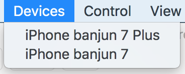

# PhotoStudioPlayer

<h3 align="center">
  
</h3>

demo video: <https://twitter.com/banjun/status/926332370252263424>

## Usage

Attach your iPhone to Mac with lightning cable, launch PhotoStudioPlayer, and select it in `Devices` menu.

any guidance are not implemented.

1. make sure your iPhone is connected to Mac with cable
2. make sure your iPhone is visible as video source in QuickTime Player
3. launch PhotoStudioPlayer
4. select device from "Devices" menu
5. switch background color from "Stage" menu.
6. make sure capture image is pink/blue/yellow backed :cool: :eyes:

## Troubleshoots
### Can't find my iPhone on device menu
Try to reconnect iPhone, restart app, reboot iPhone.

### "The operation could not be completed" error
Try to re-create window from "Devices" menu.

## Contributing

Any feedbacks and pull requests are welcome.
